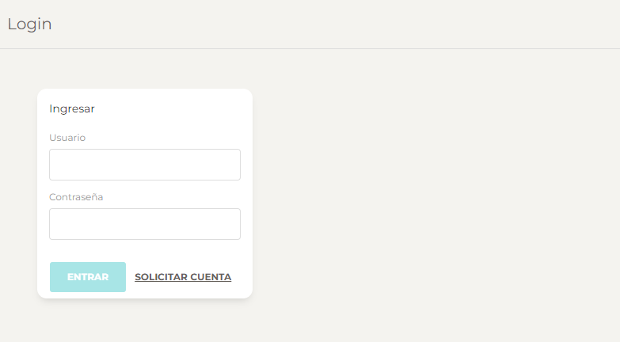
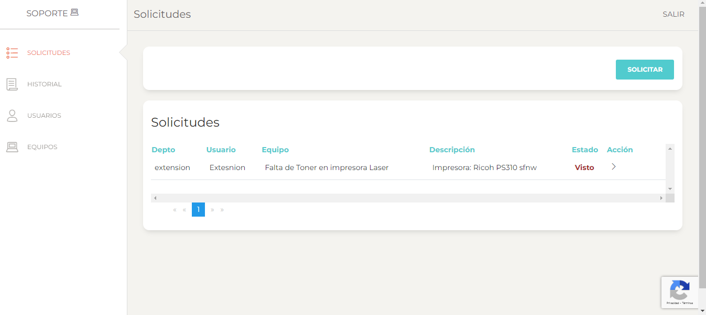

# Tickets


¡Bienvenido al sistema de Tickets!


Este repositorio contiene la implementación de un sistema de tickets desarrollado con .NET. Se va implementar una arquitectura en capas. La aplicación consta de un Web API para el backend y un frontend desarrollado con Angular.





## Clonar y Ejecutar Localmente

### Clonar el Proyecto

Para clonar este repositorio a tu máquina local, utiliza el siguiente comando:

```
git clone https://github.com/serdel1979/Tickets.Layers.git
```


### Ejecutar el Proyecto

1. **Backend (Web API):**
   - Desde el directorio del proyecto backend (`Backend/Tickets.API`), ejecuta el siguiente comando para iniciar el servidor API:
     ```
     dotnet run
     ```

2. **Frontend (Angular):**
   - Desde el directorio del proyecto frontend (`Frontend/Tickets.Front`), ejecuta el siguiente comando para iniciar la aplicación Blazor:
     ```
     ng serve
     ```

### Acceder a la Aplicación
